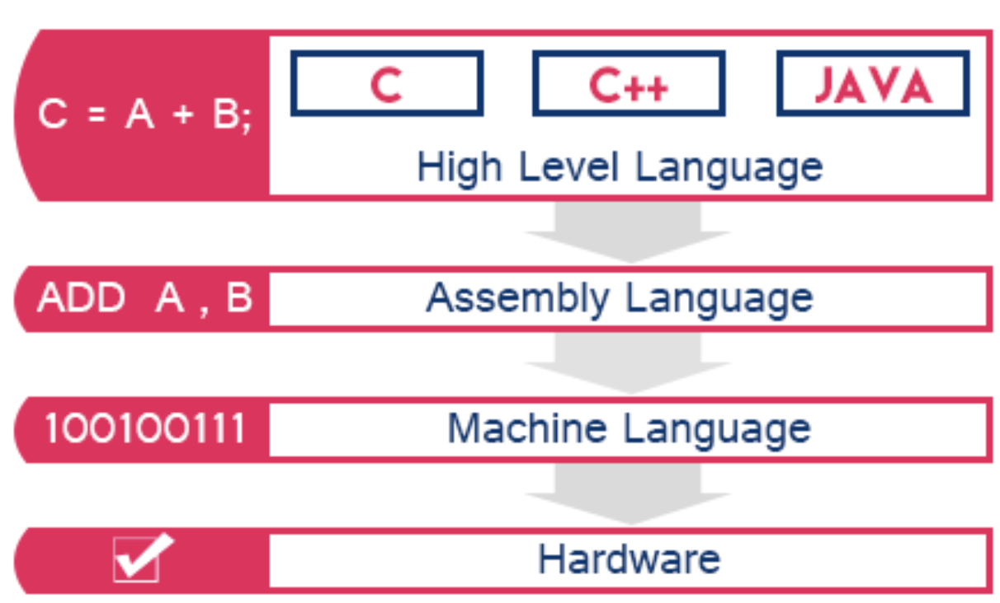
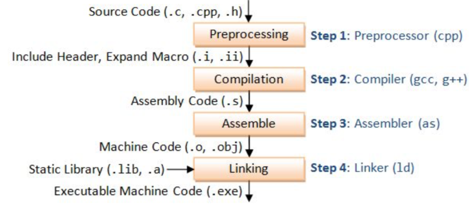
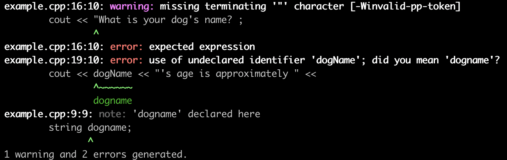
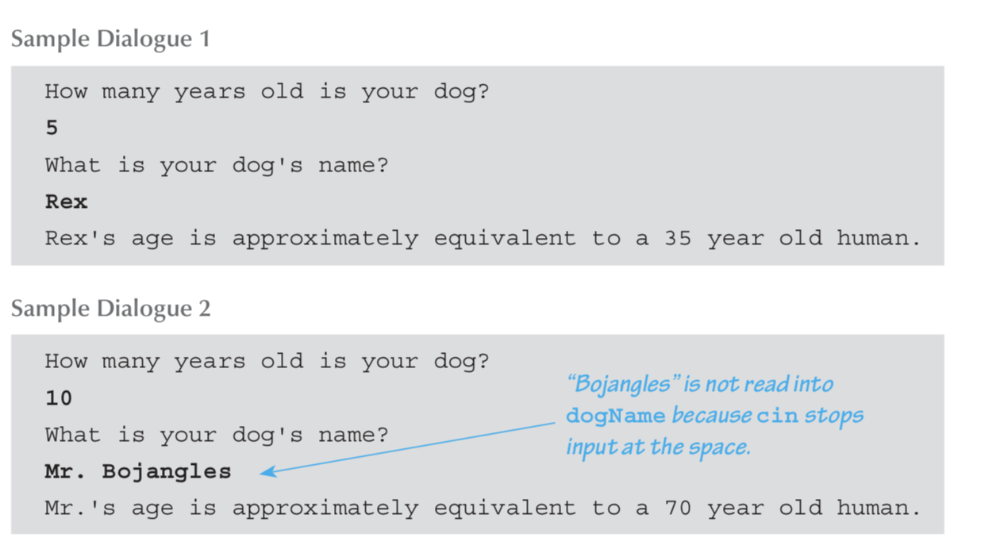

# CS31 Discussion 1G - Week1

* Hi, I am Rishab Ketan Doshi, your TA for CS31 this quarter(Winter 2019). 
* Address me as Rishab or RKD 😁
* I am a computer science Master's student. I am originally from Bangalore, a city in South India 🇮🇳!
* Joined UCLA 🐻 last Fall.

## Brief Introductions:
* Name
* Major
* What you wish to learn through CS31?

## Important Note
The material I will be creating is inspired by discussion slides from the past sessions of CS31. I have referred to slides and discussions with past TA's: Kareem Ahmed, Peter Li, Behnam Shahbazi, Arthi Padmanabhan, Angelina Poole, Shweta Sood.

## Timings 
* Discussion: Friday 02.00 – 03.50 PM, Bunche 3157
* Office hours: Thursday 08.30 – 10.30 AM, Boelter Hall (*subject to change*)

## Discussion Agenda
* Review weekly lecture: We will go through the weekly lectures and clarify concepts and answer queries you may have.
* Guidance on Project: Go over project specs and requirements
* Any Other Suggestions?

## Email
* Please use office hours, CCLE discussion board and discussion sections to clarify your queries
* Please use email sparingly
* If you do need to send me an email, ensure that the subject starts with **CS31**
* Email ID: [rishabkdoshi@g.ucla.edu](mailto:rishabkdoshi@g.ucla.edu)

## Teaching Assistant Feedback
* First time being a teaching assistant at UCLA and I want to ensure I am continuously improving and am effective as your Teaching Assistant. 🏆
* Anonymous feedback form [here](https://docs.google.com/forms/u/1/d/e/1FAIpQLSdsDIPr4GkVG8Rar4U_R9UDqYgpNAMlHpTBO988dkf6bXZwpA/viewform). 🙇🏻‍♂️
* Please feel free to drop in any suggestions or comments through the quarter.
* Requires you to be logged into your g.ucla.edu email id, this is to ensure that this form is not accessible outside of UCLA.
* **THE FEEDBACK IS ANONYMOUS** 

## Projects
### Advise
* Start early.
* Save often, make copies of assignment(on cloud) ☁️ 
* Ensure you follow project specs carefully, **word by word**
* Please make sure all file names are accurate ✅
* Write code incrementally
* All work must be your own! 

### General requirements (taken from CCLE)
1. The names of the files contained in the zip file must be ***exactly*** what the project spec states.
2. The zip file must contain only the files required by the spec, unless the spec explicitly lists optional files you may include.
3. Programs you submit as source files run sucessfully under **two compilers** from one of the following set described below: 
Visual C++ 2015 or 2017 and g++, or XCode or g++
4. If the program you turn in fails to build, your correctness score will be ***zero*** because we will be unable to test it. 🧐
5. Don't make the mistake of making a last-minute change to your program and turning it in without having first tested the effect of that change. ❌
6. Your programs will be scored on **visible results, not effort**. A program's correctness score will be closely correlated with its correctness, not with the amount of time you spent working on it.
7. When a project requires you to submit a report, that report can be a text file or a Microsoft Word document. 📄

## Some Programming Humor :P

* Finding errors in programs can often be frustrating, but overall Programming is very rewarding.
* Almost immediately you can see your code in action.
* Improve by practicing: Practice, practice, practice!

Images Courtesy: [@Thepracticaldev](https://twitter.com/Thepracticaldev)


## Project 1
Lets review project 1: https://ccle.ucla.edu/mod/assign/view.php?id=2209971

## How does a program run ?
* A programming language like C, C++, Python 🐍 are high level languages that enable humans  to instruct computers to perform certain tasks!
* Does a computer actually understand C or C++ or Python? 🤔
* A computer 💻  is essentially a complicated interconnection of different hardware components and these are then programmed using software components. It understands only 0s and 1s( on or off state basically).
* We need some process to convert programs written in high level languages like C, C++ to machine understandable 0s and 1s.



1. Machine Language: Sequence of bits; lowest level of programming
2. Assembly: Human readable view of machine language using mnemonic names and symbols instead of raw sequences of bits.
3. Higher level languages are easy for humans to understand; more abstract → lots of layers

### Compilation to execution



1. Preprocessor: Header files, generates macro code
2. Compiler: File is compiled into assembly language
3. Assembler: Assembler code is assembled into the object (machine) code
4. Linker: Object (machine) code file is linked with the object code files for any library functions used to produce an executable file.


*This section is courtesy Angelina Poole's discussion slides from an older session of CS31*

## Environment setup: Let's get to work!

We are going to make a sample Hello World program run on our computers.

### Setup our SEASnet accounts

**Q**. Why set up a SEASnet account? 🙇🏻‍♀️<br>
**A**. To compile code on g31 compiler on the SEASnet systems. 🤓

What all will we need ?

* We need to securely connect to these systems inside UCLA from any external network, maybe when we are connected to home WiFi -> Cisco VPN.

* We need to copy files from our system to the SEASnet systems -> Filezilla

* We need to execute commands inside the SEASnet system:
<b>Windows</b> -> Putty client for SSH
<b>MacOS</b> -> Terminal on MacOS.

### Downloads
### Windows
Download Filezilla, Cisco VPN, Putty client.

* Filezilla: https://filezilla-project.org/download.php?platform=win64
* Cisco VPN: https://help.bol.ucla.edu/kb_view.do?sysparm_article=kb0010923
* Putty: https://www.seasnet.ucla.edu/putty/

### MacOS
Download Filezilla, Cisco VPN
* Filezilla : https://filezilla-project.org/download.php?type=client
* Cisco VPN: https://help.bol.ucla.edu/kb_view.do?sysparm_article=kb0010924

## Let's start
* Copy code file from your system to seasnet using fileZilla
* ssh and log in to your SEASnet account (Windows: Use PuTTy)

```
ssh lnxsrv09.seas.ucla.edu -l <seasnet_username>

```

for me this is


```
ssh lnxsrv09.seas.ucla.edu -l rishabd

```

* Run this command, this needs to be done only once

```
curl -s -L http://cs.ucla.edu/classes/winter19/cs31/Utilities/setupg31 |bash

```

### How to compile and run a program on seasnet?
1. Using filezilla copy the program(say fileName is main.cpp) file(say  to a fixed location(say you copy it to Desktop) in your seasnet machine.
2. Login to your seasnet box by using the below command. (requires you to be on VPN)


```
ssh lnxsrv09.seas.ucla.edu -l <seasnet_username>

```

3. Navigate to the location where you copied main.cpp in step 1. 

Navigation can be done by using `ls` and `cd` commands. 
* `ls` lists the files in the current location
* `cd` lets you go inside a directory.

For example to navigate to Desktop in our case, after logging in using ssh as in step 2.

You will type `ls` to list all the files and directories in the current location.

```
ls

```

The output for this will be something like this

```
Desktop  Documents  Downloads  nsdefault  perl5

```

Now since our file(main.cpp) is in Desktop, we navigate to Desktop by using cd command.

```
cd Desktop

```

4. Check that the file you copied is in the directory, by running the ls command
```
ls
```

output is 

```
main.cpp

```

5.  Run below commands one by one( courtesy Prof. Stahl)

```
g31 -c main.cpp
g31 -o runnable main.o
./runnable
```

6. This will execute the file main.cpp


## Sample Programs

Program 1: https://github.com/rishabkdoshi/CS31-Winter19/blob/master/week1/code/example1.cpp

All programs being discussed here are on my github: https://github.com/rishabkdoshi/CS31-Winter19/blob/master/week1/code/

```
//this is a single line comment, any thing that follows // in a line is commented out

/*
This is a multi-line comment.
*/

/**
 C++ includes a number of standard libraries.
In fact, it is almost impossible to write a C++ program
without using at least one of these libraries.
The normal way to make a library available to your program is with an include directive.
 
 --absolute C++ textbook
 **/

//this iostream library has 'methods' required to read and write to 'user terminal'
#include <iostream>		// for std::cout
// 'methods' for now can be considered to be special pieces of code that have logic to execute specific functionality
// 'user terminal' is also referred to as standard input and standard output (std io)

// when a program is being executed,
// the computer looks for the main method to start execution
int main( ) //this is the method declaration
{
    //finds the method 'cout' in the 'std' namespace and prints the message("Hello World!\n") given
    std::cout << "Hello World!\n";
    
    //what is \n, it is a special character that signifies a line break on the std io(standard input/output.)
    
    //after program is executed it returns a 0 to the computer,
    //notice that 0 is an integer, if you look at the method declaration, it starts with int
    //this signifies that this method will return an int after completing execution.
    return 0;
}
```

Variant 2: using namespace

```
//variant 2: using namespace

#include <iostream>      // for std::cout
using namespace std;    // supports cout

int main( )
{
    //notice we dont prepend `std` to the below cout call
    cout << "Hello World!\n";
    return 0;
}
```

### What are comments?
* Comments are pieces of code that are not executed.
* Can be used to give info about surrounding pieces of code.
* Helpful and can improve readability of code, especially in large projects.

### What is a namespace?
* Informs the compiler to look for definitions in a specific namespace.
* When you call certain external `functions` in your code, the compiler looks for these functions in a ^namespace^.
* What does that mean? 
	* Suppose you have 2 phonebook's. One for family contacts, another one for work contacts. When someone asks you to get contact info for ***Bob from work***, you are going to use the work phonebook. This can be thought of as saying: 
```
using namespace work;
```

## Variables & Datatypes
* Variables can be used to store values in a program. 
* These values can be modified further to produce more values. 

Ex: In an addition program, we can have a variable called as sum which keeps getting updated for every new number getting added.

Something as below: Adding 1,2,3

* sum = 1+2 => sum = 3
* sum = sum + 3 => sum = 6

Here sum is a variable.

If we are adding only integers, the value taken by sum will always be an integer. So we use an ‘int’ data-type to signify this.
This tells the computer that we will be dealing with integer data-type, and computer uses this information to decide how much memory to allocate for this variable.

<!--
```
 int num;
 double val;
 
 1. num = 17 / 2 + 4;

 2. val = 17 / 2 + 4;

 3. num = 17 / 2.0 + 4;

 4. val = 17 / 2.0 + 4;
 
 5. num = 11 % 6 / 2 - 1;
 
 6. val = 11 % 6 / 2.0 - 1;
 
 7. num = 3 - (5 + 10 / (2 * 2));
 
 Solve below questions together
 
 8. val = 3 - (5 + 10 / (2 * 3.0));
 
 9. val = 4.5 * (5 - 3);
 num = val;
 
 num is
 val is
 
 10. num = 15 / 2 % 3 - 1;
 num is
 
 11. num = 7 * 2 - 5 / 3;
 val = num;

 num is
 val is 
``` 
-->

*The below sections on cin, cout, getline are taken from the textbook for the course, absolute c++*

## cout
The values of variables as well as strings of text may be output to the screen using cout. Any combination of variables and strings can be output.

What will be below output?

```
#include <iostream>
using namespace std;

int main()
{
	cout << "Hello world.\n"
         << "Welcome to CS31.\n";
	return 0;
}
```

What will be below output?

```
#include <iostream>
using namespace std;

int main()
{
	int numberOfGames = 2;
   cout << numberOfGames << " games played.";
}
```

<!--
This statement outputs two strings, one per line. Using cout, you can output any number of items, each either a string, a variable, or a more complicated expression. Simply insert a << before each thing to be output.
-->

## cin
You use cin to take inputs from the user that cin is used in place of cout and the arrows point in the opposite direction. 

### How cin works? 
When a program reaches a cin statement, it waits for input to be entered from the keyboard. 
It sets the first variable equal to the first value typed at the keyboard, the second variable equal to the second value typed, and so forth. 
However, the program does not read the input until the user presses the Return key. 
This allows the user to backspace and correct mistakes when entering a line of input.

### Whitespaces
Numbers in the input must be separated by one or more spaces or by a line break. These delimiting characters are called whitespace. When you use cin statements, the computer will skip over any number of blanks or line breaks until it finds the next input value. Thus, it does not matter whether input numbers are separated by one space or several spaces or even a line break. This same behavior holds when you are reading data into a string. This means that you cannot input a string that contains spaces. 


### Example Programs

```
cout << "Enter the number of dragons\n"
         << "followed by the number of trolls.\n";
cin >> dragons >> trolls;
```

can also use the below way

```
cin >> dragons
        >> trolls;

```

```
#include <iostream>
#include <string>

using namespace std;

int main()
{
	string dogname;
	int actualAge, humanAge;
	
	cout << "How old is your dog?\n" ;
	cin >> actualAge;
	humanAge = actualAge * 7;
	
	cout << "What is your dog's name? ;
	cin >> dogname;
	
	cout << dogName << "'s age is approximately " <<
           "equivalent to a " << humanAge << " year old human." << endl;

	return 0;
}
```

what's the error in the above program ? 🤔🧐




fixed program:

```
#include <iostream>
#include <string>

using namespace std;

int main()
{
	string dogName;
	int actualAge, humanAge;
	
	cout << "How old is your dog?\n" ;
	cin >> actualAge;
	humanAge = actualAge * 7;
	
	cout << "What is your dog's name?" ;
	cin >> dogName;
	
	cout << dogName << "'s age is approximately " <<
           "equivalent to a " << humanAge << " year old human." << endl;

	return 0;
}
```




### How to remember arrow directions for cin and cout?
Simple Hack!

In cin, the console is *sending* values to the program. so arrows are essentially pointing ***outwards*** cin like this

```
cin >> variable_name (outward arrow)
```

In cout, the console is *receiving* values from the program, so arrows are pointing ***inwards*** cout like this

```
cout << variable_name (inward arrow)
```

## getline

What is the problem with cin?
<!--Can't take inputs having spaces in them.-->

`getline` solves this problem.

* It reads a texual line ending with newline, consuming the newline character itself.
* Reads characters one by one and stores them into str until the newline character, '\n' is found.
* When '\n' is found, it is extracted and discarded (i.e. it is not stored and the next input operation will begin after it).

Note that any content in str before the call is replaced by the newly extracted sequence.

### Example Program
```
#include <iostream>
using namespace std;

int main() {
    
    string gLineInput, cinInput;
    
    cout << "Input for getLine \n ";
    getline(cin, gLineInput);
    cout << "getLine read: " << gLineInput << endl;
    
    cout << "Input for cin \n ";
    cin >> cinInput;
    cout << "cin read: " << cinInput << endl;
    
    return 0;
    
}

```

 
## Errors and Types

When running programs, you may often see `errors`

### Compile time errors: 
* Detected during compilation of program
* Ex: Trying to use a variable that’s not declared. Run compile_error.cpp
* Ex: Incorrect syntax, using syntax not following the variable naming rules in the language

```
#include <iostream>

int main(){
    int j=0;
    std::cout << i;
}
```


### Logic / Run time errors
* Compilation occurs properly, error occurs when program executes
* Program may or may not crash. Run runtime_error.cpp
* Passing an invalid input value, example?
* When in doubt, use parentheses
```
#include <iostream>
using namespace std;

int main()
{
	float a,b,average;
	a = 2.0;
	b = 2.0;
	average = a+b/2; 
	cout << average << endl;
}
```

### Worksheet Problems 1 & 2
