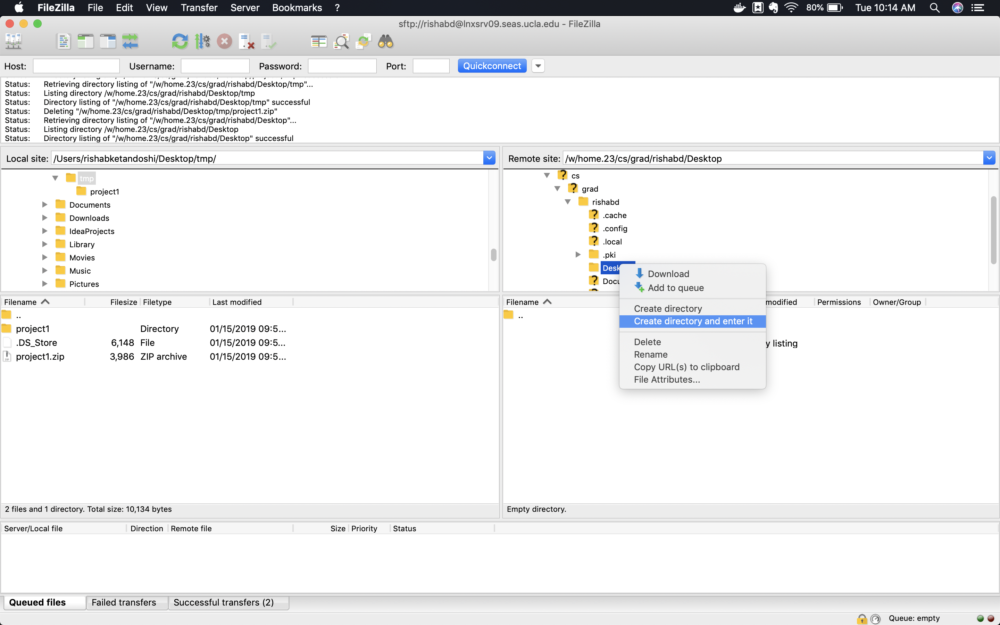
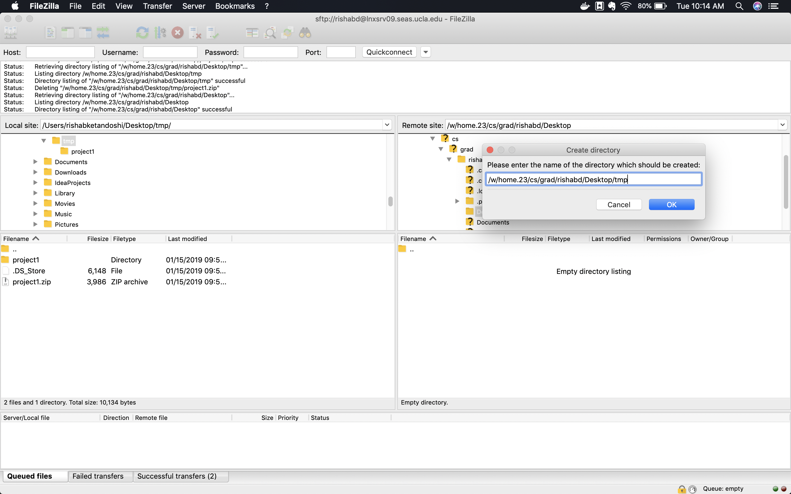
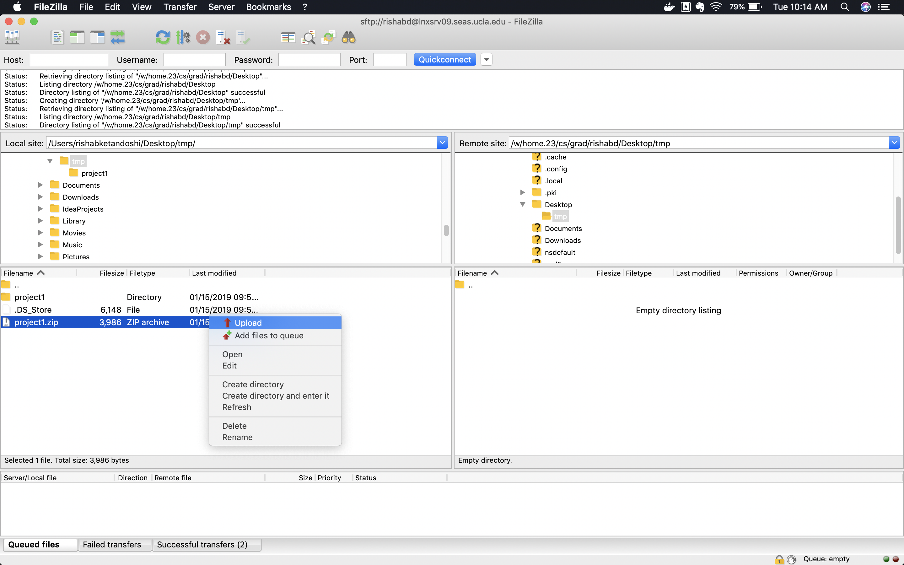
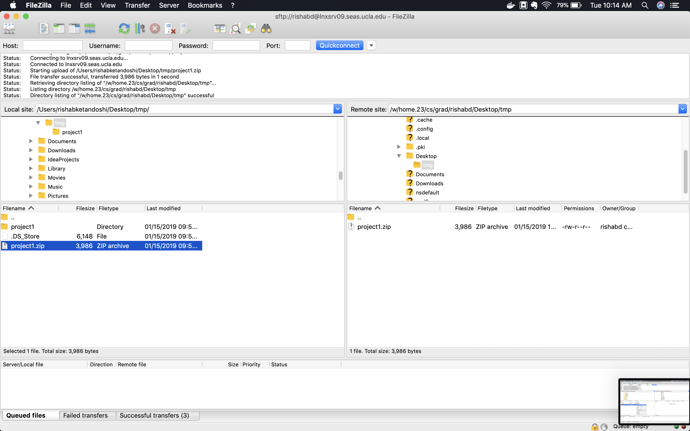

## Project 1 Submission help

I have been receiving emails especially from students using windows, to verify if the zip file they have created is in the right format.

Please follow the below steps to check that your zip file that you are submitting has all your work.

### Copy zip file to seasnet
Upload the zip file to a specific location on your SEASnet box. (this could be done using scp or filezilla, see instructions on CCLE). For the purposes of this tutorial, I have copied it to a **new** folder called  `tmp` on `Desktop`. **I strongly recommend creating a new folder and then copying the zip file there, to make sure that you are able to verify it correctly.**

Screenshots below:

* Creating a directory


* Naming the directory


* Copy project1.zip to tmp directory


* After the above steps you should see the project1.zip in your right hand side as below.


### Verify files
Login to your SEASnet account and navigate to the directory where you copied the zip file to. The commands to be entered into Putty for windows or terminal are as below.

* Login to SEASNET:

```
ssh lnxsrv09.seas.ucla.edu -l <your_seasnet_username>
```
* Navigate to directory you copied the zip file to


```
cd Desktop/tmp
```
since, I copied it to Desktop/tmp. I used the above command.

* list whatever is in the directory, by using the `ls` command.

```
ls
```

the output for the above command for me is 

```
project1.zip
```

* unzip the project1.zip by running below command

```
unzip project1.zip 

```

* list the files in current directory, by running the `ls` command. You should see something like this. Depends on name of your folder before zipping, I had named mine project1, so I see below output.

```
project1  project1.zip
```

* navigate to the folder, by using `cd` command

```
cd project1

```

* list the files in this directory, by using `ls` command. You should see the files you copied into the folder. Below is my output

```
compile_error.cpp  logic_error.cpp  original.cpp  report.txt

```

* verify that all files have what you worked on by using the below command.

Ex: To verify logic_error.cpp is actually what I worked on, I type

```
cat logic_error.cpp

```

The output for above command will be the whole logic_error.cpp file on the terminal/putty client. Check that the output has all the code you have written. Repeat this for all cpp and txt files. by using 

```cat <filename>```

**If you have a report.docx file, the output of this command won't make sense. But as long as report.docx exists in the output of previous step of `ls` command, you are good**
